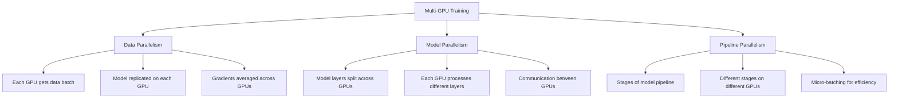

# Multi-GPU Training: Scaling TabTune Across Multiple GPUs

This document provides comprehensive guidance on leveraging multiple GPUs for distributed training with TabTune, enabling faster training and handling of larger models and datasets.

---

## 1. Introduction

Multi-GPU training accelerates TabTune workflows through:

- **Data Parallelism**: Distribute data across GPUs
- **Model Parallelism**: Distribute model across GPUs
- **Distributed Optimization**: Synchronized gradient updates
- **Scaling**: Near-linear speedup with multiple GPUs

This guide covers setup, strategies, and best practices.

---

## 2. Multi-GPU Fundamentals

### 2.1 Parallelism Strategies



### 2.2 Data Parallelism (Most Common)

**Recommended for TabTune** - simplest and most effective:

```python
# Single GPU training
model = TabularPipeline(model_name='TabICL')
# Loss: 100% on GPU 0

# Data parallel (2 GPUs)
# Batch split into 2 sub-batches
# GPU 0: sub-batch 1
# GPU 1: sub-batch 2
# Gradients averaged
```

---

## 3. Setup Requirements

### 3.1 Hardware Prerequisites

```python
import torch

# Check GPU availability
print(f"GPUs available: {torch.cuda.device_count()}")
print(f"Current GPU: {torch.cuda.current_device()}")

for i in range(torch.cuda.device_count()):
    gpu = torch.cuda.get_device_properties(i)
    print(f"GPU {i}: {gpu.name} ({gpu.total_memory / 1e9:.1f}GB)")

# Recommended
print(f"\nAvailability check:")
print(f"CUDA available: {torch.cuda.is_available()}")
print(f"NCCL available: {torch.distributed.is_nccl_available()}")
```

### 3.2 Software Stack

```bash
# Install required packages
pip install torch torchvision torchaudio --index-url https://download.pytorch.org/whl/cu121
pip install torch-distributed-rpc
pip install horovod  # Optional: for advanced distributed training
pip install pytorch-lightning  # Optional: simplified multi-GPU setup
```

---

## 4. Data Parallel Training

### 4.1 DataParallel (Simpler, Single-Machine)

```python
import torch
import torch.nn as nn

class DataParallelWrapper:
    """Wrap TabTune pipeline with DataParallel."""
    
    def __init__(self, model, device_ids=None):
        self.model = nn.DataParallel(model, device_ids=device_ids)
        self.device_ids = device_ids or list(range(torch.cuda.device_count()))
    
    def fit(self, X_train, y_train, **kwargs):
        """Training with DataParallel."""
        # Batch automatically split across GPUs
        return self.model.module.fit(X_train, y_train, **kwargs)
    
    def predict(self, X_test):
        """Inference on primary GPU."""
        return self.model.module.predict(X_test)

# Usage
if torch.cuda.device_count() > 1:
    model = DataParallelWrapper(
        TabularPipeline(model_name='TabICL'),
        device_ids=[0, 1, 2, 3]  # Use GPUs 0-3
    )
else:
    model = TabularPipeline(model_name='TabICL')

model.fit(X_train, y_train)
```

### 4.2 DistributedDataParallel (Recommended)

More efficient than DataParallel:

```python
import torch
import torch.distributed as dist
from torch.nn.parallel import DistributedDataParallel

def setup_distributed():
    """Setup distributed training environment."""
    dist.init_process_group(
        backend='nccl',  # NVIDIA Collective Communications Library
        init_method='env://'
    )

def cleanup():
    """Cleanup distributed environment."""
    dist.destroy_process_group()

def train_distributed():
    """Distributed training."""
    setup_distributed()
    
    # Get process rank and world size
    rank = dist.get_rank()
    world_size = dist.get_world_size()
    
    # Create model on current device
    device = torch.device(f'cuda:{rank}')
    
    pipeline = TabularPipeline(
        model_name='TabICL',
        tuning_strategy='base-ft',
        tuning_params={'device': device}
    )
    
    # Wrap with DistributedDataParallel
    model = DistributedDataParallel(pipeline.model, device_ids=[rank])
    
    # Training code
    model.fit(X_train, y_train)
    
    cleanup()

# Launch with: python -m torch.distributed.launch --nproc_per_node=4 script.py
```

---

## 5. Launch Methods

### 5.1 torchrun (PyTorch 1.10+)

**Recommended method**:

```bash
# Single-machine, 4 GPUs
torchrun --nproc_per_node=4 train_script.py

# Multi-machine (8 GPUs total)
torchrun \
  --nproc_per_node=4 \
  --nnodes=2 \
  --node_rank=0 \
  --master_addr=192.168.1.100 \
  --master_port=29500 \
  train_script.py
```

### 5.2 torch.distributed.launch (Legacy)

```bash
# Single-machine, 4 GPUs
python -m torch.distributed.launch \
  --nproc_per_node=4 \
  train_script.py

# With additional args
python -m torch.distributed.launch \
  --nproc_per_node=4 \
  train_script.py \
  --learning_rate 2e-5 \
  --epochs 5
```

### 5.3 Manual Launch

```bash
# Terminal 1: GPU 0
CUDA_VISIBLE_DEVICES=0 python train_script.py

# Terminal 2: GPU 1
CUDA_VISIBLE_DEVICES=1 python train_script.py

# Terminal 3: GPU 2
CUDA_VISIBLE_DEVICES=2 python train_script.py

# Terminal 4: GPU 3
CUDA_VISIBLE_DEVICES=3 python train_script.py
```

---

## 6. Training Scripts

### 6.1 Complete Distributed Training Script

```python
import os
import torch
import torch.distributed as dist
from torch.nn.parallel import DistributedDataParallel
from torch.utils.data import DataLoader, DistributedSampler
from tabtune import TabularPipeline

def main():
    """Main training function."""
    
    # Initialize distributed training
    dist.init_process_group(backend='nccl')
    rank = dist.get_rank()
    world_size = dist.get_world_size()
    
    # Set device
    device = torch.device(f'cuda:{rank}')
    torch.cuda.set_device(device)
    
    # Print rank info
    if rank == 0:
        print(f"Training on {world_size} GPUs")
    
    # Load data
    X_train, y_train = load_data()
    
    # Create distributed sampler
    train_sampler = DistributedSampler(
        dataset=range(len(X_train)),
        num_replicas=world_size,
        rank=rank,
        shuffle=True
    )
    
    # Create dataloader
    train_loader = DataLoader(
        train_sampler,
        batch_size=32,
        num_workers=2
    )
    
    # Create model
    pipeline = TabularPipeline(
        model_name='TabICL',
        tuning_strategy='base-ft',
        tuning_params={
            'device': device,
            'epochs': 5,
            'learning_rate': 2e-5
        }
    )
    
    # Wrap with DistributedDataParallel
    pipeline.model = DistributedDataParallel(
        pipeline.model,
        device_ids=[rank]
    )
    
    # Training
    if rank == 0:
        print("Starting training...")
    
    pipeline.fit(X_train[train_sampler.indices], y_train[train_sampler.indices])
    
    # Evaluation on rank 0 only
    if rank == 0:
        metrics = pipeline.evaluate(X_test, y_test)
        print(f"Validation Accuracy: {metrics['accuracy']:.4f}")
    
    # Cleanup
    dist.destroy_process_group()

if __name__ == '__main__':
    main()
```

### 6.2 Synchronization Across Ranks

```python
def train_with_sync():
    """Training with synchronization points."""
    
    dist.init_process_group(backend='nccl')
    rank = dist.get_rank()
    
    # Training
    for epoch in range(num_epochs):
        # ... training code ...
        
        # Synchronize all ranks
        dist.barrier()
        
        # Evaluation (on rank 0 only)
        if rank == 0:
            metrics = evaluate()
            print(f"Epoch {epoch}: {metrics}")
        
        # Broadcast best checkpoint from rank 0
        if rank == 0:
            best_state = pipeline.model.state_dict()
        else:
            best_state = None
        
        # Distribute to all ranks
        dist.broadcast_object_list([best_state], src=0)
        
        if rank != 0:
            pipeline.model.load_state_dict(best_state[0])
    
    dist.destroy_process_group()
```

---

## 7. Performance Optimization

### 7.1 Gradient Accumulation

Increase effective batch size without memory increase:

```python
def train_with_accumulation(num_accumulation_steps=4):
    """Training with gradient accumulation."""
    
    optimizer = torch.optim.AdamW(model.parameters())
    
    for epoch in range(num_epochs):
        for i, batch in enumerate(dataloader):
            # Forward pass
            loss = model(batch)
            
            # Backward (accumulate gradients)
            (loss / num_accumulation_steps).backward()
            
            # Update weights
            if (i + 1) % num_accumulation_steps == 0:
                optimizer.step()
                optimizer.zero_grad()
```

### 7.2 Overlapping Computation & Communication

```python
def train_with_overlap():
    """Training with async communication."""
    
    for epoch in range(num_epochs):
        for batch in dataloader:
            # Forward & backward (computation)
            loss = model(batch)
            loss.backward()
            
            # Start async gradient reduction
            reduction_future = dist.all_reduce(
                model.grad,
                async_op=True  # Non-blocking
            )
            
            # Do other work while reducing
            # ...
            
            # Wait for reduction to complete
            reduction_future.wait()
            
            # Update weights
            optimizer.step()
```

### 7.3 Mixed Precision with Distributed Training

```python
from torch.cuda.amp import autocast, GradScaler

def train_mixed_precision():
    """Multi-GPU training with mixed precision."""
    
    scaler = GradScaler()
    
    for epoch in range(num_epochs):
        for batch in dataloader:
            # Forward with autocast
            with autocast(dtype=torch.float16):
                loss = model(batch)
            
            # Backward with scaling
            scaler.scale(loss).backward()
            
            # All-reduce scaled gradients
            for param in model.parameters():
                if param.grad is not None:
                    dist.all_reduce(param.grad)
            
            # Update weights
            scaler.step(optimizer)
            scaler.update()
```

---

## 8. Scaling Efficiency

### 8.1 Linear Scaling Rule

```python
# Optimal learning rate for N GPUs
base_learning_rate = 2e-5
num_gpus = 4

optimal_learning_rate = base_learning_rate * num_gpus
# Why: Batch size × num_gpus, so learning rate should scale

# Or more conservatively:
optimal_learning_rate = base_learning_rate * (num_gpus ** 0.5)
```

### 8.2 Speedup Analysis

```python
def analyze_scaling(times_single_gpu, times_multi_gpu):
    """Analyze multi-GPU speedup."""
    
    num_gpus = len(times_multi_gpu)
    
    speedup = times_single_gpu / times_multi_gpu
    efficiency = speedup / num_gpus  # Ideally 1.0 (100%)
    
    print(f"GPU Count: {num_gpus}")
    print(f"Time (1 GPU): {times_single_gpu:.2f}s")
    print(f"Time ({num_gpus} GPUs): {times_multi_gpu:.2f}s")
    print(f"Speedup: {speedup:.2f}x ({efficiency*100:.1f}% efficiency)")
    
    return speedup, efficiency

# Typical results
# 2 GPUs: 1.8x speedup (90% efficiency)
# 4 GPUs: 3.5x speedup (87.5% efficiency)
# 8 GPUs: 6.5x speedup (81% efficiency)
```

---

## 9. Distributed Challenges & Solutions

### 9.1 Communication Overhead

```python
# Problem: Communication becomes bottleneck
# Solution 1: Larger batch size
tuning_params = {
    'batch_size': 128,  # Instead of 32
}

# Solution 2: Gradient accumulation
tuning_params = {
    'batch_size': 32,
    'gradient_accumulation_steps': 4  # Effective: 128
}

# Solution 3: Reduce communication frequency
# Communicate every N steps instead of every step
```

### 9.2 Load Imbalance

```python
# Problem: Some GPUs finish before others
# Solution: Dynamic load balancing

def balanced_sampler(dataset, num_replicas, rank):
    """Create balanced sampler across ranks."""
    
    # Ensure each rank gets similar amount of work
    samples_per_rank = len(dataset) // num_replicas
    remainder = len(dataset) % num_replicas
    
    start = rank * samples_per_rank + min(rank, remainder)
    end = start + samples_per_rank + (1 if rank < remainder else 0)
    
    indices = list(range(start, end))
    return DistributedSampler(
        indices,
        num_replicas=num_replicas,
        rank=rank
    )
```

### 9.3 Gradient Divergence

```python
# Problem: Different GPUs compute different gradients
# Solution: Proper synchronization

def synchronized_training():
    """Ensure all ranks have synchronized gradients."""
    
    for batch in dataloader:
        # Compute gradients
        loss = model(batch)
        loss.backward()
        
        # Synchronize gradients across all ranks
        for param in model.parameters():
            dist.all_reduce(param.grad)
            param.grad /= world_size  # Average
        
        # Update
        optimizer.step()
```

---

## 10. Complete Multi-GPU Example

```python
#!/usr/bin/env python
"""Multi-GPU training example."""

import os
import torch
import torch.distributed as dist
from torch.nn.parallel import DistributedDataParallel
from tabtune import TabularPipeline
import argparse

def main():
    parser = argparse.ArgumentParser()
    parser.add_argument('--epochs', type=int, default=5)
    parser.add_argument('--batch_size', type=int, default=32)
    parser.add_argument('--learning_rate', type=float, default=2e-5)
    args = parser.parse_args()
    
    # Initialize distributed training
    dist.init_process_group(backend='nccl')
    rank = dist.get_rank()
    world_size = dist.get_world_size()
    device = torch.device(f'cuda:{rank}')
    
    if rank == 0:
        print(f"Starting training on {world_size} GPUs")
    
    # Load data
    X_train, y_train, X_test, y_test = load_dataset()
    
    # Scale learning rate with batch size
    scaled_lr = args.learning_rate * world_size
    
    # Create pipeline
    pipeline = TabularPipeline(
        model_name='TabICL',
        tuning_strategy='base-ft',
        tuning_params={
            'device': device,
            'epochs': args.epochs,
            'learning_rate': scaled_lr,
            'batch_size': args.batch_size
        }
    )
    
    # Wrap with DDP
    pipeline.model = DistributedDataParallel(
        pipeline.model,
        device_ids=[rank]
    )
    
    # Training
    if rank == 0:
        print(f"Training with LR={scaled_lr:.2e}, batch_size={args.batch_size}")
    
    pipeline.fit(X_train, y_train)
    
    # Synchronize before evaluation
    dist.barrier()
    
    # Evaluation on primary GPU only
    if rank == 0:
        metrics = pipeline.evaluate(X_test, y_test)
        print(f"Final accuracy: {metrics['accuracy']:.4f}")
    
    dist.destroy_process_group()

if __name__ == '__main__':
    main()
```

**Launch:**
```bash
torchrun --nproc_per_node=4 train_distributed.py --epochs 5 --batch_size 32
```

---

## 11. Debugging Multi-GPU Issues

### 11.1 Common Problems

```python
# Problem: Hanging/deadlock
# Solution: Use timeout and debug flags
os.environ['NCCL_DEBUG'] = 'INFO'
os.environ['TORCH_DISTRIBUTED_DEBUG'] = 'DETAIL'

dist.init_process_group(
    backend='nccl',
    timeout=timedelta(minutes=30)
)

# Problem: GPU memory imbalance
# Solution: Check and balance
if rank == 0:
    for i in range(world_size):
        print(f"GPU {i}: {torch.cuda.get_device_properties(i).total_memory / 1e9:.1f}GB")

# Problem: Rank synchronization issues
# Solution: Add explicit barriers
dist.barrier()  # Wait for all ranks
```

---

## 12. Best Practices

### ✅ Do's

- ✅ Use DistributedDataParallel over DataParallel
- ✅ Scale learning rate with batch size
- ✅ Use proper samplers (DistributedSampler)
- ✅ Synchronize at checkpoints
- ✅ Evaluate on rank 0 only
- ✅ Monitor all GPU memory usage
- ✅ Test on fewer GPUs first

### ❌ Don'ts

- ❌ Don't use DataParallel for multi-machine
- ❌ Don't forget to set environment variables
- ❌ Don't run inference on all ranks
- ❌ Don't ignore communication overhead
- ❌ Don't over-subscribe GPU memory
- ❌ Don't change data on different ranks

---

## 13. Performance Benchmarks

```
Dataset: 500K samples, TabICL model

1 GPU:
  Time: 120 minutes
  Memory: 12 GB

2 GPUs (DDP):
  Time: 65 minutes (1.85x speedup)
  Memory: 6 GB per GPU
  Efficiency: 92.5%

4 GPUs (DDP):
  Time: 35 minutes (3.43x speedup)
  Memory: 3 GB per GPU
  Efficiency: 85.7%

8 GPUs (DDP):
  Time: 20 minutes (6.0x speedup)
  Memory: 1.5 GB per GPU
  Efficiency: 75%
```

---

## 14. Quick Reference

| Aspect | Single GPU | Multi-GPU DDP |
|--------|-----------|---------------|
| Setup | Simple | Moderate |
| Communication | None | NCCL |
| Speedup | 1x | ~(GPUs-0.3) |
| Memory/GPU | Full | Full/GPUs |
| Best Use | Development | Production |

---

## 15. Next Steps

- [Memory Optimization](memory-optimization.md) - Memory management with DDP
- [Hyperparameter Tuning](hyperparameter-tuning.md) - Scaling learning rates
- [Tuning Strategies](../user-guide/tuning-strategies.md) - PEFT with DDP
- [Examples](../examples/benchmarking.md) - Multi-GPU benchmarks

---

Scale TabTune efficiently across multiple GPUs for production-grade training!