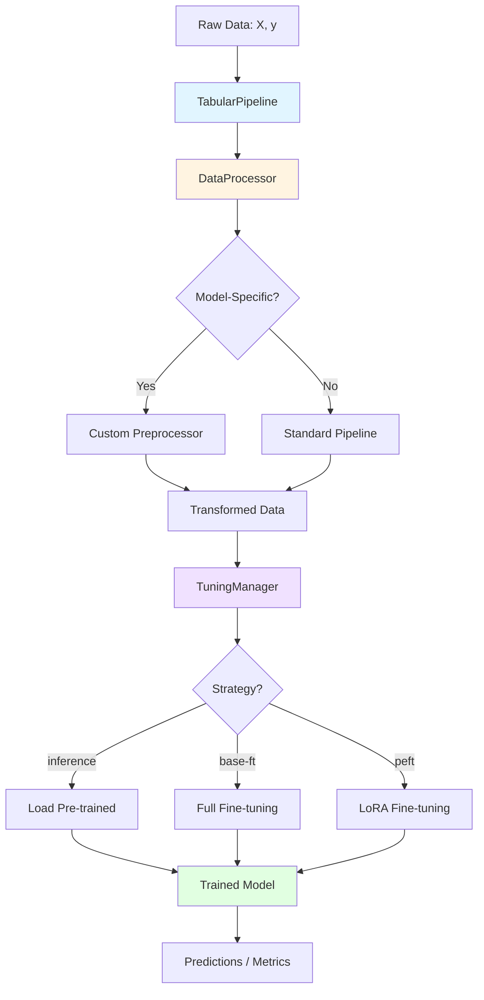

# Basic Concepts

This page introduces the core ideas, architecture, and workflow used across TabTune. Understanding these concepts will help you effectively use TabTune for your tabular machine learning tasks.

---

## 1. Tasks

TabTune currently focuses on **classification** tasks:

- **Classification**: Multi-class and binary classification (fully supported)
- **Regression**: Planned for future releases

---

## 2. Core Components

TabTune is built on four main components that work together seamlessly:

### 2.1 TabularPipeline

The main user-facing interface that provides a scikit-learn-compatible API.

**Key Methods:**
- `.fit(X, y)`: Train/preprocess the pipeline on training data
- `.predict(X)`: Generate predictions on new data
- `.predict_proba(X)`: Get probability predictions (classification)
- `.evaluate(X, y)`: Calculate performance metrics
- `.save(path)`: Serialize the entire pipeline
- `.load(path)`: Load a saved pipeline

**Purpose**: Simplifies the entire workflow into a single, easy-to-use interface.

### 2.2 DataProcessor

A smart, model-aware data preparation engine that automatically handles preprocessing based on your chosen model.

**Responsibilities:**
- **Imputation**: Handle missing values (mean, median, mode, etc.)
- **Scaling**: Normalize numerical features (standard, min-max, robust)
- **Encoding**: Transform categorical features (one-hot, ordinal, target encoding)
- **Model-Specific Processing**: Apply specialized transformations for each model type
- **Feature Selection**: Optional dimensionality reduction

**Key Feature**: Automatically selects the correct preprocessing strategy based on `model_name`, eliminating manual configuration.

### 2.3 TuningManager

The computational core that manages model adaptation and training strategies.

**Strategies:**
- **`inference`**: Zero-shot predictions using pre-trained weights (no training)
- **`base-ft`**: Full fine-tuning of all model parameters
- **`peft`**: Parameter-efficient fine-tuning using LoRA adapters (memory-efficient)

**Purpose**: Abstracts away complex training loops, episodic fine-tuning, and optimization details.

### 2.4 TabularLeaderboard

A benchmarking tool for comparing multiple models and strategies on the same dataset splits.

**Features:**
- Compare multiple models simultaneously
- Test different tuning strategies
- Rank results by any metric
- Export results for analysis

**Purpose**: Streamline model selection and hyperparameter exploration.

---

## 3. Component Relationships



**Flow Explanation:**
1. Raw data enters `TabularPipeline`
2. `DataProcessor` applies model-aware preprocessing
3. `TuningManager` executes the chosen training strategy
4. Final model generates predictions and metrics

---

## 4. Workflow

Here's the typical workflow for using TabTune:

### Step 1: Prepare Your Data

```python
import pandas as pd
from sklearn.model_selection import train_test_split

# Load your data
df = pd.read_csv('your_data.csv')
X = df.drop('target', axis=1)  # Features
y = df['target']  # Labels

# Split into train/test
X_train, X_test, y_train, y_test = train_test_split(
    X, y, test_size=0.2, random_state=42
)
```

### Step 2: Initialize the Pipeline

```python
from tabtune import TabularPipeline

pipeline = TabularPipeline(
    model_name="TabICL",              # Choose your model
    task_type="classification",        # Task type
    tuning_strategy="base-ft",         # Training strategy
    tuning_params={
        "device": "cuda",
        "epochs": 5,
        "learning_rate": 2e-5
    }
)
```

### Step 3: Train the Model

```python
# This automatically:
# 1. Fits the DataProcessor (learns preprocessing transformations)
# 2. Applies preprocessing to training data
# 3. Trains the model using TuningManager
pipeline.fit(X_train, y_train)
```

### Step 4: Make Predictions

```python
# Generate predictions
predictions = pipeline.predict(X_test)

# Get probability scores
probabilities = pipeline.predict_proba(X_test)

# Evaluate performance
metrics = pipeline.evaluate(X_test, y_test)
print(f"Accuracy: {metrics['accuracy']:.4f}")
print(f"F1 Score: {metrics['f1_score']:.4f}")
```

### Step 5: Save and Reload

```python
# Save the entire pipeline (including preprocessing and model state)
pipeline.save("my_pipeline.joblib")

# Later, reload for inference
loaded_pipeline = TabularPipeline.load("my_pipeline.joblib")
new_predictions = loaded_pipeline.predict(new_data)
```

---

## 5. Models

TabTune supports multiple state-of-the-art tabular foundation models:

| Model | Family | Best Use Case |
|-------|--------|---------------|
| **TabPFN** | PFN/ICL | Small datasets (<10K rows), quick baselines |
| **TabICL** | Scalable ICL | General-purpose, balanced performance |
| **OrionMSP** | Scalable ICL | Large datasets, strong generalization |
| **OrionBix** | Scalable ICL | High-accuracy requirements |
| **TabDPT** | Denoising Transformer | Very large datasets (>100K rows) |
| **Mitra** | 2D Attention | Complex patterns, mixed data types |
| **ContextTab** | Semantic ICL | Text-heavy tabular features |

See the [Models Overview](../models/overview.md) for detailed comparisons and selection guidance.

---

## 6. Tuning Strategies Explained

### Inference (`inference`)
- **What**: Uses pre-trained model weights without any training
- **When**: Quick baselines, zero-shot evaluation
- **Training Time**: 0 seconds
- **Memory**: Minimal

### Base Fine-Tuning (`base-ft`)
- **What**: Updates all model parameters during training
- **When**: Maximum accuracy is priority, ample compute resources
- **Training Time**: Moderate to long (depending on dataset size)
- **Memory**: High (requires full model in memory)

### PEFT (`peft`)
- **What**: Parameter-efficient fine-tuning using LoRA adapters
- **When**: Memory-constrained environments, fast iteration
- **Training Time**: Faster than base-ft
- **Memory**: Low (only adapter weights updated)

See [Tuning Strategies](../user-guide/tuning-strategies.md) for detailed comparisons.

---

## 7. Key Principles

1. **Model-Aware Processing**: The `DataProcessor` automatically selects optimal preprocessing based on your chosen model
2. **Unified API**: Same interface (`.fit()`, `.predict()`) for all models and strategies
3. **Automatic Optimization**: `TuningManager` handles complex training loops, learning rate schedules, and optimization
4. **Reproducibility**: Save entire pipelines (including preprocessing) for consistent results

---

## 8. Next Steps

- **[Installation Guide](installation.md)**: Set up TabTune in your environment
- **[Quick Start](quick-start.md)**: Run your first end-to-end example
- **[Pipeline Overview](../user-guide/pipeline-overview.md)**: Deep dive into TabularPipeline
- **[Model Selection](../user-guide/model-selection.md)**: Choose the right model for your task
- **[Tuning Strategies](../user-guide/tuning-strategies.md)**: Understand training options

---

## 9. Common Patterns

### Pattern 1: Quick Baseline
```python
pipeline = TabularPipeline(model_name="TabPFN", tuning_strategy="inference")
pipeline.fit(X_train, y_train)
metrics = pipeline.evaluate(X_test, y_test)
```

### Pattern 2: Production Model
```python
pipeline = TabularPipeline(
    model_name="OrionBix",
    tuning_strategy="base-ft",
    tuning_params={"epochs": 10, "learning_rate": 2e-5}
)
pipeline.fit(X_train, y_train)
pipeline.save("production_model.joblib")
```

### Pattern 3: Memory-Efficient Training
```python
pipeline = TabularPipeline(
    model_name="TabICL",
    tuning_strategy="peft",
    tuning_params={"peft_config": {"r": 8}}
)
pipeline.fit(X_train, y_train)
```

Understanding these basic concepts will help you effectively leverage TabTune's capabilities for your tabular machine learning projects.