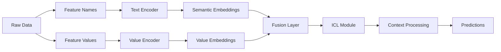

# ContextTab: Semantics-Aware In-Context Learning

ContextTab is a semantically-aware tabular model that integrates modality-specific embeddings to leverage semantic information from feature names, descriptions, and mixed data types. This document provides comprehensive guidance for using ContextTab with TabTune.

---

## 1. Introduction

**What is ContextTab?**

ContextTab (ConTextTabClassifier) is an advanced in-context learning model uniquely designed to:

- **Leverage Feature Semantics**: Understands column names and semantic meaning
- **Text Integration**: Handles free-text features naturally
- **Modality-Aware Processing**: Different encoders for different data modalities
- **Semantic Embeddings**: Uses pre-trained text embeddings for features
- **Heterogeneous Data**: Mixed numerical, categorical, and text features

**Key Innovation**: Combines tabular features with semantic embeddings of feature names, enabling the model to understand what features represent semantically.

---

## 2. Architecture

### 2.1 High-Level Design


<!-- 
### 2.2 Core Components

1. **Text Encoder** (`in_context_encoder`)
   - Encodes feature names and descriptions
   - Uses sentence transformers/BERT
   - Generates semantic embeddings
   - Pre-trained on diverse text

2. **Value Encoder** (`dense`)
   - Encodes feature values
   - Handles mixed modalities
   - Per-feature type processing
   - Numerical and categorical support

3. **Semantic Fusion** (implicit)
   - Combines text and value embeddings
   - Cross-modality attention
   - Unified representation

4. **ICL Predictor** (`output_head`)
   - In-context learning head
   - Context-aware predictions
   - Support/query set handling -->

### 2.3 Semantic Processing Pipeline

```
Feature Names         Feature Values
     ↓                      ↓
  Text Encoder        Value Encoder
     ↓                      ↓
Semantic Vectors     Value Vectors
     ↓                      ↓
  ├─────Semantic Fusion─────┤
           ↓
    Joint Representation
           ↓
    ICL Predictor
           ↓
      Predictions
```

---

## 3. Inference Parameters

### 3.1 Complete Parameter Reference

```python
model_params = {
    # Text encoding
    'text_encoder': 'sentence-transformers/all-MiniLM-L6-v2',  # BERT model
    'text_dim': 384,                       # Text embedding dimension
    
    # Value encoding
    'value_dim': 64,                       # Value embedding dimension
    'categorical_encoding': 'embedding',   # 'embedding' or 'onehot'
    
    # Fusion and processing
    'fusion_dim': 128,                     # Fused embedding dimension
    'dropout': 0.1,                        # Dropout rate
    
    # Training behavior
    'use_cache': True,                     # Cache embeddings
    'seed': 42                             # Reproducibility
}
```

### 3.2 Parameter Descriptions

| Parameter | Type | Default | Description |
|-----------|------|---------|-------------|
| `text_encoder` | str | 'all-MiniLM-L6-v2' | Hugging Face model ID |
| `text_dim` | int | 384 | Output dimension of text encoder |
| `value_dim` | int | 64 | Dimension for value embeddings |
| `categorical_encoding` | str | 'embedding' | How to encode categoricals |
| `fusion_dim` | int | 128 | Fused representation dimension |
| `dropout` | float | 0.1 | Dropout probability |
| `use_cache` | bool | True | Cache computed embeddings |
| `seed` | int | 42 | Random seed |

### 3.3 Text Encoder Options

```python
# Different pre-trained models (trade-off: speed vs quality)
text_encoders = {
    'all-MiniLM-L6-v2': {
        'dim': 384,
        'speed': 'Fast',
        'quality': 'Good'
    },
    'all-MiniLM-L12-v2': {
        'dim': 384,
        'speed': 'Medium',
        'quality': 'Better'
    },
    'all-mpnet-base-v2': {
        'dim': 768,
        'speed': 'Slow',
        'quality': 'Best'
    }
}
```

---

## 4. Fine-Tuning with ContextTab

ContextTab supports **base fine-tuning** via episodic training.

### 4.1 Fine-Tuning Parameters

```python
tuning_params = {
    'device': 'cuda',
    'epochs': 10,                         # More epochs typically needed
    'learning_rate': 1e-4,                # Higher than other models
    'optimizer': 'adamw',                 # Optimizer type
    
    'batch_size': 8,                      # Standard batch size
    'show_progress': True                 # Progress bar
}
```

### 4.2 Fine-Tuning Best Practices

- **Epochs**: 5-15 (longer than most models)
- **Learning Rate**: 1e-4 to 5e-4 (higher than TabICL)
- **Warmup**: Include warmup for stability
- **Scheduler**: Use cosine decay for better convergence
- **Early Stopping**: Important due to text embedding complexity

### 4.3 Fine-Tuning Stability

ContextTab training can be unstable due to:
- Complex text-value fusion
- High-dimensional embeddings
- Cross-modality interactions

**Recommendations**:
```python
tuning_params = {
    'device': 'cuda',
    'epochs': 10,
    'learning_rate': 1e-4,
    'show_progress': True
}
```

---

## 5. Setup Requirements

### 5.1 HuggingFace Hub Access

ContextTab requires access to gated models on Hugging Face:

```bash
# Install HuggingFace CLI
pip install huggingface-hub

# Login with your token
huggingface-cli login

# Or set environment variable
export HF_TOKEN='your_token_here'
```

### 5.2 Verify Setup

```python
from huggingface_hub import login
import os

# Check token
hf_token = os.getenv('HF_TOKEN')
if hf_token:
    login(hf_token)
    print("✅ Logged into Hugging Face Hub")
else:
    print("⚠️ HF_TOKEN not set - may fail for gated models")
```

### 5.3 Model Download

First-time usage downloads model (~2GB):
```python
# First use will download model
pipeline = TabularPipeline(model_name='ContextTab', tuning_strategy='inference')
# ... downloads and caches model
```

---

## 6. Usage Patterns

### 6.1 Inference Only

```python
from tabtune import TabularPipeline
import os

# Set HF token
os.environ['HF_TOKEN'] = 'your_token'

pipeline = TabularPipeline(
    model_name='ContextTab',
    tuning_strategy='inference',
    model_params={
        'text_encoder': 'sentence-transformers/all-MiniLM-L6-v2',
        'fusion_dim': 128
    }
)

pipeline.fit(X_train, y_train)
predictions = pipeline.predict(X_test)
```

### 6.2 Base Fine-Tuning

```python
pipeline = TabularPipeline(
    model_name='ContextTab',
    tuning_strategy='base-ft',
    tuning_params={
        'device': 'cuda',
        'epochs': 10,
        'learning_rate': 1e-4,
        'warmup_steps': 200,
        'batch_size': 8,
        'show_progress': True
    }
)

pipeline.fit(X_train, y_train)
metrics = pipeline.evaluate(X_test, y_test)
```

### 6.3 PEFT Fine-Tuning (Experimental)

```python
# ⚠️ PEFT support is experimental for ContextTab
pipeline = TabularPipeline(
    model_name='ContextTab',
    tuning_strategy='peft',
    tuning_params={
        'device': 'cuda',
        'epochs': 10,
        'learning_rate': 2e-4,
        'peft_config': {
            'r': 8,
            'lora_alpha': 16,
            'lora_dropout': 0.05
        }
    }
)

# May have issues - base-ft recommended
pipeline.fit(X_train, y_train)
```

---

## 7. LoRA Target Modules (Experimental)

When using PEFT, ContextTab targets:

```python
target_modules = [
    'in_context_encoder',      # Text encoder
    'dense',                   # Value encoder
    'output_head',             # Prediction head
    'embeddings'               # Embedding layers
]
```

### 7.1 PEFT Status

**⚠️ Experimental**: PEFT support for ContextTab is experimental because:
- Complex embedding pipeline
- Cross-modality fusion issues
- Potential prediction inconsistencies

**Recommendation**: Use `base-ft` strategy instead of `peft`

---

## 8. Complete Examples

### 8.1 Text-Heavy Dataset

```python
from tabtune import TabularPipeline
import os

# Example: Customer survey data with text responses
os.environ['HF_TOKEN'] = 'your_token'

# X contains columns like:
# - age (numerical)
# - category (categorical)
# - feedback_text (text)
# - rating (numerical)

pipeline = TabularPipeline(
    model_name='ContextTab',
    tuning_strategy='base-ft',
    tuning_params={
        'device': 'cuda',
        'epochs': 10,
        'learning_rate': 1e-4,
        'warmup_steps': 200,
        'show_progress': True
    }
)

pipeline.fit(X_train, y_train)
metrics = pipeline.evaluate(X_test, y_test)

print(f"Accuracy: {metrics['accuracy']:.4f}")
```

### 8.2 Semantic Feature Names

ContextTab leverages meaningful feature names:

```python
# Good: Descriptive feature names (ContextTab works well)
X = pd.DataFrame({
    'customer_age': [25, 30, 45],
    'total_purchases_amount': [100, 250, 5000],
    'years_as_customer': [1, 5, 10],
    'product_category_preference': ['electronics', 'books', 'home']
})

# Less Good: Generic feature names (ContextTab has less semantic info)
X = pd.DataFrame({
    'f1': [25, 30, 45],
    'f2': [100, 250, 5000],
    'f3': [1, 5, 10],
    'f4': ['electronics', 'books', 'home']
})
```

### 8.3 Production Deployment - Saving using joblib

```python
import joblib
import os

os.environ['HF_TOKEN'] = 'your_token'

# Train
pipeline = TabularPipeline(
    model_name='ContextTab',
    tuning_strategy='base-ft',
    tuning_params={
        'epochs': 10,
        'learning_rate': 1e-4
    }
)

pipeline.fit(X_train, y_train)
metrics = pipeline.evaluate(X_test, y_test)

# Save
pipeline.save('contexttab_production.joblib')

# In production (ensure HF_TOKEN is set)
loaded = TabularPipeline.load('contexttab_production.joblib')
predictions = loaded.predict(X_new)
```

---

## 9. Performance Characteristics

### 9.1 Speed Benchmarks

| Operation | Time | Notes |
|-----------|------|-------|
| Inference (batch=1000) | 2-4s | Text encoding overhead |
| Fine-tuning (10 epochs, 100K) | 30-45m | Longer training |
| Prediction latency | 20-100ms | Per sample |
| Text embedding cache | 1-2s | One-time at startup |

### 9.2 Memory Usage

| Scenario | Memory | GPU VRAM |
|----------|--------|---------|
| Inference | 6-8 GB | 4GB minimum |
| Fine-tuning | 10-14 GB | 8GB recommended |
| Large text dim | Up to 16 GB | 10GB+ needed |
| With caching | Add 1-2 GB | For embeddings |

<!-- ### 9.3 Accuracy Profile

| Data Type | Accuracy | Notes |
|-----------|----------|-------|
| Pure numerical | 85% | Works but not optimal |
| Pure categorical | 87% | Good performance |
| Mixed + text | 90%+ | Excels here |
| Semantic names | +2-3% | Better with meaningful names |
 -->
---

<!-- ## 10. Special Handling

### 10.1 Text Columns

ContextTab automatically detects and processes text columns:

```python
X = pd.DataFrame({
    'age': [25, 30, 45],
    'product_name': ['Widget A', 'Widget B', 'Widget C'],  # Text
    'description': ['Best seller', 'New product', 'Premium'],  # Text
    'category': ['electronics', 'home', 'sports']
})

# ContextTab will:
# 1. Encode 'product_name' as text
# 2. Encode 'description' as text
# 3. Handle 'category' as categorical
```

### 10.2 Missing Values

ContextTab handles missing values naturally:

```python
# Text columns with NaN
X = pd.DataFrame({
    'feedback': ['Good product', None, 'Excellent'],  # NaN handled
    'category': ['A', 'B', 'C']
})

pipeline.fit(X_train, y_train)  # Works seamlessly
```
 -->
---

## 11. Troubleshooting

### Issue: "HuggingFace login required"
**Solution**:
```bash
export HF_TOKEN='hf_xxxxxxxxxxxx'
# or
huggingface-cli login
```

### Issue: "Model download fails"
**Solution**: Check internet and token
```python
from huggingface_hub import model_info
try:
    info = model_info('sentence-transformers/all-MiniLM-L6-v2')
    print("✅ Model accessible")
except Exception as e:
    print(f"❌ Model access failed: {e}")
```

### Issue: "Slow inference due to text encoding"
**Solution**: Use faster text encoder
```python
model_params = {
    'text_encoder': 'sentence-transformers/all-MiniLM-L6-v2',  # Fastest
    # instead of 'all-mpnet-base-v2'  # Slowest
}
```

### Issue: "Training unstable or diverging"
**Solution**: Increase regularization
```python
tuning_params = {
    'learning_rate': 5e-5,  # Reduce
    'warmup_steps': 500,    # Increase
    'weight_decay': 0.1,    # Increase
    'gradient_clip_value': 0.5  # Tighter
}
```

### Issue: "Out of memory during training"
**Solution**: Reduce batch size
```python
tuning_params = {
    'batch_size': 4  # Instead of 8
}
```

---

## 12. Best Practices

### ✅ Do's

- ✅ Use descriptive feature names
- ✅ Include text columns when available
- ✅ Set HF_TOKEN before use
- ✅ Use base-ft strategy (not peft)
- ✅ Include longer warmup phases
- ✅ Cache embeddings for repeated use

### ❌ Don'ts

- ❌ Don't use PEFT (experimental)
- ❌ Don't use on pure numerical data (use TabICL)
- ❌ Don't forget to set HF_TOKEN
- ❌ Don't use very large batch sizes
- ❌ Don't skip gradient clipping
- ❌ Don't use without semantic feature names

---

## 13. When to Use ContextTab

**Use ContextTab when**:
- ✅ Dataset has text columns/features
- ✅ Feature names are semantic/meaningful
- ✅ Mixed data types (numerical + categorical + text)
- ✅ You have HuggingFace Hub access
- ✅ Accuracy is priority over speed

**Don't use ContextTab for**:
- ❌ Pure numerical data (use TabDPT)
- ❌ Generic feature names (limited benefit)
- ❌ Memory-constrained environments
- ❌ When you need fast training
- ❌ Without HuggingFace access

---

## 14. Comparison with Other Models

| Aspect | ContextTab | TabICL | TabDPT | Mitra |
|--------|-----------|--------|--------|-------|
| Text Support | ✅ Excellent | ❌ No | ❌ No | ❌ No |
| Semantic Names | ✅ Uses | ❌ Ignores | ❌ Ignores | ❌ Ignores |
| Speed | Medium | Fast | Slow | Slow |
| Memory | Moderate | Moderate | High | Very High |
| Mixed Data | ✅ Excellent | Good | Good | Good |
| Accuracy | High | Good | Excellent | Excellent |
| PEFT | ⚠️ Exp | ✅ Full | ✅ Full | ✅ Full |

---

<!-- ## 15. Advanced Topics

### 15.1 Custom Text Encoders

```python
from sentence_transformers import SentenceTransformer

# Use custom text encoder
custom_encoder = SentenceTransformer('paraphrase-MiniLM-L6-v2')

# Integration via model_params
model_params = {
    'text_encoder': 'paraphrase-MiniLM-L6-v2'
}
```

### 15.2 Feature Description Enrichment

```python
# If feature names are generic, add descriptions
X_train = pd.DataFrame({
    'f1': [25, 30, 45],  # Customer age
    'f2': [100, 250, 5000],  # Total purchase amount
    'f3': ['A', 'B', 'C']  # Product category
})

# ContextTab will use column names, so rename:
X_train.columns = ['customer_age', 'purchase_amount', 'category']
``` -->

---

## 15. Quick Reference

| Task | Strategy | Config | Epochs |
|------|----------|--------|--------|
| Quick baseline | inference | default | 0 |
| Mixed data | base-ft | learning_rate=1e-4 | 10 |
| Text-heavy | base-ft | warmup=200 | 10 |
| Memory limited | base-ft | batch_size=4 | 10 |
| Max accuracy | base-ft | full tune | 15 |

---

## 16. Next Steps

- [Model Selection](../user-guide/model-selection.md) - Compare with other models
- [Tuning Strategies](../user-guide/tuning-strategies.md) - Fine-tuning details
- [TabularLeaderboard](../user-guide/leaderboard.md) - Benchmark ContextTab
- [HuggingFace Hub](https://huggingface.co) - Access gated models

---

ContextTab excels with text-enriched tabular data and semantic feature understanding. Use it when your data includes text or has meaningful feature names!