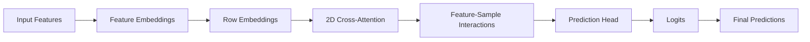

# Mitra: 2D Cross-Attention for Tabular Data

Mitra (also known as Tab2D) is a sophisticated tabular model featuring 2D cross-attention mechanisms for modeling both row-wise and column-wise dependencies. This document provides comprehensive guidance for using Mitra with TabTune.

---

## 1. Introduction

**What is Mitra?**

Mitra is an advanced in-context learning model that captures complex interactions through:

- **2D Cross-Attention**: Simultaneous row (sample) and column (feature) modeling
- **Synthetic Priors**: Pre-trained representations for tabular data
- **Mixed-Type Feature Handling**: Natural support for numerical and categorical data
- **Episodic Training**: Task-specific adaptation via meta-learning

**Key Innovation**: 2D attention mechanism simultaneously models relationships both across rows (samples) and columns (features), enabling superior pattern discovery.

---

## 2. Architecture

### 2.1 High-Level Design



<!-- ### 2.2 Core Components

1. **Feature Embedder** (`x_embedding`)
   - Encodes each feature independently
   - Learns feature-specific representations
   - Handles mixed data types

2. **Row Embedder** (implicit)
   - Sample-level representations
   - Position and context encoding
   - Sample-specific patterns

3. **2D Cross-Attention** (`layers`)
   - Feature-to-sample attention
   - Sample-to-feature attention
   - Bidirectional interaction modeling

4. **Prediction Head** (`final_layer`)
   - Aggregates 2D representations
   - Outputs class logits
   - Task-specific predictions -->

### 2.3 2D Attention Mechanism

```
Row Embeddings         Feature Embeddings
      ↓                       ↓
      └─────────2D Cross-Attention─────────┘
             ↓
    Joint Row-Feature Representation
             ↓
         Prediction Head
             ↓
          Output
```

### 2.4 Synthetic Priors

Mitra incorporates synthetic prior knowledge:
- Pre-trained on diverse tabular data
- Captures common patterns
- Accelerates learning on new tasks
- Improves generalization

---

## 3. Inference Parameters

### 3.1 Complete Parameter Reference

```python
model_params = {
    # Architecture parameters
    'd_model': 64,                         # Feature embedding dimension
    'd_ff': 128,                           # Feedforward hidden dimension
    'num_heads': 4,                        # Attention heads
    'num_layers': 2,                       # Stacked layers
    
    # Training behavior
    'dropout': 0.1,                        # Dropout rate
    'use_synthetic_prior': True,           # Use pre-trained prior
    'seed': 42                             # Reproducibility
}
```

### 3.2 Parameter Descriptions

| Parameter | Type | Default | Range | Description |
|-----------|------|---------|-------|-------------|
| `d_model` | int | 64 | 32-256 | Feature embedding dimension |
| `d_ff` | int | 128 | 64-512 | Feedforward network hidden size |
| `num_heads` | int | 4 | 2-8 | Number of attention heads |
| `num_layers` | int | 2 | 1-4 | Number of transformer layers |
| `dropout` | float | 0.1 | 0.0-0.3 | Dropout probability |
| `seed` | int | 42 | 0+ | Random seed |

### 3.3 Architecture Tuning

| Config | Speed | Accuracy | Memory |
|--------|-------|----------|--------|
| Small: d_model=32, num_layers=1 | ⭐⭐⭐⭐⭐ | ⭐⭐ | ⭐ |
| Medium: d_model=64, num_layers=2 | ⭐⭐⭐⭐ | ⭐⭐⭐ | ⭐⭐ |
| Large: d_model=128, num_layers=4 | ⭐⭐⭐ | ⭐⭐⭐⭐⭐ | ⭐⭐⭐ |

---

## 4. Fine-Tuning with Mitra

Mitra uses episodic fine-tuning for task-specific adaptation.

### 4.1 Fine-Tuning Parameters

```python
tuning_params = {
    'device': 'cuda',
    'epochs': 3,                          # Training epochs
    'learning_rate': 1e-5,                # Optimizer learning rate
    'optimizer': 'adamw',                 # Optimizer type
    
    # Episodic parameters
    'support_size': 128,                  # Support set size
    'query_size': 128,                    # Query set size
    'n_episodes': 500,                    # Episodes per epoch
    'steps_per_epoch': 50,                # Gradient steps per epoch
    'batch_size': 4,                      # Episodes per batch (small!)
    
    'show_progress': True                 # Progress bar
}
```

### 4.2 Key Parameters

| Parameter | Type | Default | Description |
|-----------|------|---------|-------------|
| `support_size` | int | 128 | Context samples per episode |
| `query_size` | int | 128 | Query samples per episode |
| `n_episodes` | int | 500 | Total episodes for training |
| `steps_per_epoch` | int | 50 | Gradient updates per epoch |
| `batch_size` | int | 4 | Episodes per batch (keep small) |

### 4.3 Why Small Batch Size?

Mitra's 2D attention is computationally expensive:
- Attention complexity: \(O(n^2)\) for both rows and columns
- Memory grows rapidly with batch size
- Empirically: batch_size=4-8 is optimal
- Larger: Use gradient accumulation instead

### 4.4 Fine-Tuning Guidelines

**Support/Query Balance**:
```
support_size = 128  # Larger context for pattern discovery
query_size = 128    # Balance for gradient signal
```

**Learning Rate Strategy**:
- Start: 1e-5
- If converging slowly: increase to 2e-5
- If diverging: decrease to 5e-6

**Episode Count**:
- Small dataset (10K): 500 episodes
- Medium dataset (100K): 1000 episodes
- Large dataset (500K): 2000 episodes

---

## 5. LoRA Target Modules

When using PEFT, Mitra targets these modules:

```python
target_modules = [
    'x_embedding',           # Feature embedder
    'layers',                # Attention layers
    'final_layer'            # Prediction head
]
```

### 5.1 Default PEFT Configuration

```python
peft_config = {
    'r': 8,
    'lora_alpha': 16,
    'lora_dropout': 0.05,
    'target_modules': None  # Uses defaults above
}
```

### 5.2 PEFT Rank Guidelines

| Rank | Memory | Speed | Accuracy |
|------|--------|-------|----------|
| r=4 | Minimal | Fast | Good |
| r=8 | Low | Moderate | Better |
| r=16 | Moderate | Slower | Best |

---

## 6. Usage Patterns

### 6.1 Inference Only

```python
from tabtune import TabularPipeline

pipeline = TabularPipeline(
    model_name='Mitra',
    tuning_strategy='inference',
    model_params={
        'd_model': 64,
        'num_layers': 2,
        'use_synthetic_prior': True
    }
)

pipeline.fit(X_train, y_train)  # Preprocessing only
predictions = pipeline.predict(X_test)
```

### 6.2 Base Fine-Tuning

```python
pipeline = TabularPipeline(
    model_name='Mitra',
    tuning_strategy='base-ft',
    tuning_params={
        'device': 'cuda',
        'epochs': 3,
        'learning_rate': 1e-5,
        'support_size': 128,
        'query_size': 128,
        'batch_size': 4,  # Small!
        'show_progress': True
    }
)

pipeline.fit(X_train, y_train)
metrics = pipeline.evaluate(X_test, y_test)
```

### 6.3 PEFT Fine-Tuning

```python
pipeline = TabularPipeline(
    model_name='Mitra',
    tuning_strategy='peft',
    tuning_params={
        'device': 'cuda',
        'epochs': 3,
        'learning_rate': 2e-5,  # Higher for PEFT
        'support_size': 64,     # Reduced for memory
        'query_size': 64,
        'batch_size': 2,        # Very small
        'peft_config': {
            'r': 8,
            'lora_alpha': 16,
            'lora_dropout': 0.05
        }
    }
)

pipeline.fit(X_train, y_train)
```

### 6.4 Architecture Customization

```python
pipeline = TabularPipeline(
    model_name='Mitra',
    tuning_strategy='base-ft',
    model_params={
        'd_model': 128,      # Larger embeddings
        'num_layers': 4,     # More layers
        'num_heads': 8,      # More heads
        'd_ff': 256
    },
    tuning_params={
        'epochs': 5,
        'learning_rate': 1e-5
    }
)
```

---

## 7. Complete Examples

### 7.1 Basic Workflow

```python
from tabtune import TabularPipeline
from sklearn.model_selection import train_test_split
import pandas as pd

# Load data
df = pd.read_csv('structured_data.csv')
X = df.drop('target', axis=1)
y = df['target']

# Split
X_train, X_test, y_train, y_test = train_test_split(
    X, y, test_size=0.2, random_state=42
)

# Train with Mitra
pipeline = TabularPipeline(
    model_name='Mitra',
    tuning_strategy='base-ft',
    tuning_params={
        'device': 'cuda',
        'epochs': 3,
        'support_size': 128,
        'query_size': 128,
        'batch_size': 4,
        'learning_rate': 1e-5
    }
)

pipeline.fit(X_train, y_train)
metrics = pipeline.evaluate(X_test, y_test)

print(f"Accuracy: {metrics['accuracy']:.4f}")
print(f"F1 Score: {metrics['f1_score']:.4f}")
```

### 7.2 PEFT for Memory Constraints

```python
# Use PEFT when memory is limited
pipeline = TabularPipeline(
    model_name='Mitra',
    tuning_strategy='peft',
    tuning_params={
        'device': 'cuda',
        'epochs': 3,
        'learning_rate': 2e-5,
        'support_size': 64,    # Reduced
        'query_size': 64,      # Reduced
        'batch_size': 2,       # Very small
        'steps_per_epoch': 30, # Fewer steps
        'peft_config': {
            'r': 4,            # Lower rank
            'lora_alpha': 8,
            'lora_dropout': 0.1
        }
    }
)

pipeline.fit(X_train, y_train)
```

### 7.3 Architecture Search

```python
from tabtune import TabularLeaderboard

# Compare architectures
lb = TabularLeaderboard(X_train, X_test, y_train, y_test)

# Small model
lb.add_model(
    'Mitra',
    'base-ft',
    name='Mitra-Small',
    model_params={
        'd_model': 32,
        'num_layers': 1
    },
    tuning_params={'epochs': 3}
)

# Medium model
lb.add_model(
    'Mitra',
    'base-ft',
    name='Mitra-Medium',
    model_params={
        'd_model': 64,
        'num_layers': 2
    },
    tuning_params={'epochs': 3}
)

# Large model
lb.add_model(
    'Mitra',
    'base-ft',
    name='Mitra-Large',
    model_params={
        'd_model': 128,
        'num_layers': 4
    },
    tuning_params={'epochs': 3}
)

lb.run(rank_by='accuracy')
```

### 7.4 Production Deployment - Saving using joblib

```python
import joblib

# Train optimal model
pipeline = TabularPipeline(
    model_name='Mitra',
    tuning_strategy='base-ft',
    tuning_params={
        'device': 'cuda',
        'epochs': 5,
        'support_size': 128,
        'batch_size': 4,
        'learning_rate': 1e-5
    }
)

pipeline.fit(X_train, y_train)
metrics = pipeline.evaluate(X_test, y_test)

# Save for deployment
pipeline.save('mitra_production.joblib')

# In production
loaded = TabularPipeline.load('mitra_production.joblib')
predictions = loaded.predict(X_new)
```

---

## 8. Performance Characteristics

### 8.1 Speed Benchmarks

| Operation | Time | Notes |
|-----------|------|-------|
| Inference (batch=1000) | 3-5s | 2D attention overhead |
| Base FT (3 epochs, 100K) | 45-60m | Slow but powerful |
| PEFT (3 epochs, 100K) | 20-30m | Better speed |
| Prediction latency | 20-100ms | Per sample |

### 8.2 Memory Usage

| Scenario | Memory | GPU VRAM |
|----------|--------|---------|
| Inference | 8-10 GB | 6GB minimum |
| Base FT | 16-20 GB | 12GB recommended |
| PEFT | 10-12 GB | 6-8GB sufficient |
| Large model | Up to 24 GB | 16GB+ needed |

<!-- ### 8.3 Accuracy Profile

| Dataset | Size | Accuracy |
|---------|------|----------|
| Small | 10K | 84% |
| Medium | 100K | 89% |
| Large | 500K | 91% |
 -->
---

## 9. Best Practices

### ✅ Do's

- ✅ Use small batch sizes (2-4)
- ✅ Start with medium architecture (d_model=64)
- ✅ Monitor memory usage actively
- ✅ Use PEFT on constrained systems
- ✅ Increase support/query sizes for pattern discovery
- ✅ Use synthetic priors (faster convergence)

### ❌ Don'ts

- ❌ Don't use large batch sizes (causes OOM)
- ❌ Don't use very large models on small GPUs
- ❌ Don't skip warmup steps
- ❌ Don't disable gradient clipping
- ❌ Don't train for too many epochs (overfit risk)

---

## 10. Troubleshooting

### Issue: "CUDA out of memory"
**Solution 1**: Reduce batch size
```python
tuning_params = {
    'batch_size': 2,  # Instead of 4
    'support_size': 64,  # Instead of 128
    'query_size': 64
}
```

**Solution 2**: Use PEFT
```python
tuning_strategy = 'peft'
```

### Issue: "Training very slow"
**Solution**: Reduce model size
```python
model_params = {
    'd_model': 32,  # Instead of 64
    'num_layers': 1  # Instead of 2
}
```

### Issue: "Low accuracy"
**Solution**: Increase support set size
```python
tuning_params = {
    'support_size': 256,  # More context
    'query_size': 256,
    'n_episodes': 1000    # More training
}
```

### Issue: "Overfitting on small datasets"
**Solution**: Use regularization
```python
tuning_params = {
    'weight_decay': 0.1,  # Increase regularization
    'dropout': 0.2        # In model_params
}
```

---

## 11. Comparison with Other Models

| Aspect | Mitra | TabICL | TabDPT | OrionMSP | OrionBix |
|--------|-------|--------|--------|-----------|------------|
| Speed | Slow | Fast | Slow | Moderate | Medium |
| Memory | Very High | Moderate | High | Moderate-High | High |
| Accuracy | Excellent | Good | Excellent | Very Good | Very Good |
| Complexity | Complex | Simple | Medium | Medium | Medium |
| Small Data | Good | Good | Okay | ⚠️ | Good |
| Large Data | Good | Good | Excellent | Excellent | Good |
| PEFT | ✅ Full | ✅ Full | ✅ Full | ✅ Full | ✅ Full |

---

## 12. Quick Reference

| Use Case | Config | Batch Size | Support |
|----------|--------|-----------|---------|
| Small data (10K) | d_model=64, layers=2 | 4 | 128 |
| Medium data (100K) | d_model=64, layers=2 | 4 | 256 |
| Large data (500K) | d_model=128, layers=4 | 2 | 512 |
| Memory limited | PEFT, r=4 | 2 | 64 |
| Max accuracy | d_model=128, layers=4 | 4 | 512 |

---

<!-- ## 13. Advanced Topics

### 13.1 Attention Visualization

```python
# Inspect attention patterns
import torch

# Get attention weights
attention_weights = pipeline.model.get_attention_weights(X_test[:100])

print(f"Attention shape: {attention_weights.shape}")
print(f"Min: {attention_weights.min():.4f}, Max: {attention_weights.max():.4f}")
```

### 13.2 Feature Importance via Attention

```python
# Use attention weights for feature importance
attention = pipeline.model.get_attention_weights(X_test)
feature_importance = attention.mean(axis=0)

top_features = np.argsort(feature_importance)[-10:]
print(f"Top 10 features: {X_test.columns[top_features]}")
```
 -->
---

## 13. Next Steps

- [Model Selection](../user-guide/model-selection.md) - Compare with other models
- [Tuning Strategies](../user-guide/tuning-strategies.md) - Fine-tuning details
- [Advanced PEFT](../advanced/peft-lora.md) - LoRA optimization
- [TabularLeaderboard](../user-guide/leaderboard.md) - Benchmark Mitra

---

Mitra excels at capturing complex 2D patterns in structured tabular data. Use it when maximum accuracy and pattern discovery are priorities!