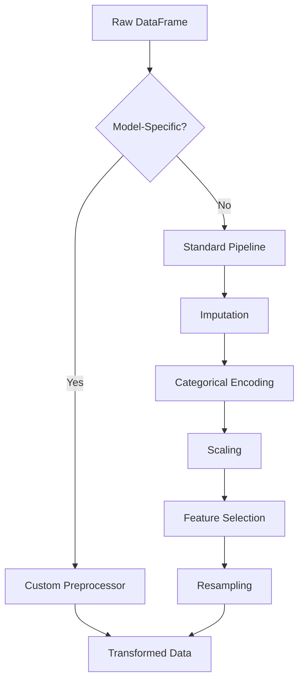

# Data Processing

The `DataProcessor` is TabTune's intelligent, model-aware data preparation engine. It automatically handles imputation, scaling, categorical encoding, feature selection, and resampling based on your chosen model's requirements.

---

## 1. Overview

The `DataProcessor` integrates two preprocessing pathways:

1. **Custom Model-Specific Preprocessing**: For models requiring specialized transformations (TabPFN, TabICL, ContextTab, Mitra, TabDPT, OrionMSP, OrionBix).
2. **Standard Preprocessing Pipeline**: For general tabular models using scikit-learn-compatible transformations.

---

## 2. Architecture



---

## 3. Initialization Parameters

```python
DataProcessor(
    model_name=None,
    override_types=None,
    imputation_strategy='mean',
    categorical_encoding='onehot',
    scaling_strategy='standard',
    resampling_strategy=None,
    feature_selection_strategy=None,
    feature_selection_k=10,
    model_params=None
)
```

### Parameter Reference

| Parameter | Type | Default | Description |
|-----------|------|---------|-------------|
| `model_name` | str | None | Model identifier to trigger custom preprocessing |
| `override_types` | dict | None | Manual column type specifications |
| `imputation_strategy` | str | 'mean' | Strategy for missing value imputation |
| `categorical_encoding` | str | 'onehot' | Categorical encoding method |
| `scaling_strategy` | str | 'standard' | Numerical feature scaling method |
| `resampling_strategy` | str | None | Class imbalance correction method |
| `feature_selection_strategy` | str | None | Feature selection algorithm |
| `feature_selection_k` | int | 10 | Number of features to select |
| `model_params` | dict | None | Additional model-specific parameters |

---

## 4. Model-Aware Defaults

When `model_name` is specified, the processor automatically configures optimal preprocessing:

| Model | Categorical Encoding | Special Handling |
|-------|---------------------|------------------|
| **TabPFN** | `tabpfn_special` | Integer encoding, limited feature count |
| **TabICL** | `tabicl_special` | Normalization + shuffling support |
| **OrionMSP** | `orionmsp_special` | Multi-scale prior preprocessing |
| **OrionBix** | `tab_biaxial_special` | Custom biaxial attention preprocessing |
| **TabDPT** | `tabdpt_special` | Context-aware transformations |
| **Mitra** | `mitra_special` | 2D attention preprocessing |
| **ContextTab** | `contexttab_special` | Text embedding integration |

---

## 5. Standard Preprocessing Pipeline

### 5.1 Missing Value Imputation

Available strategies:

- **mean**: Replace with column mean (default)
- **median**: Replace with column median
- **iterative**: Multivariate imputation using IterativeImputer
- **knn**: K-Nearest Neighbors imputation

```python
processor = DataProcessor(imputation_strategy='median')
```

### 5.2 Categorical Encoding

Supported methods:

- **onehot**: One-hot encoding (default, handles unknown categories)
- **ordinal**: Ordinal encoding with unknown value handling
- **target**: Target encoding (uses target statistics)
- **hashing**: Hashing encoder for high-cardinality features
- **binary**: Binary encoding for memory efficiency

```python
processor = DataProcessor(categorical_encoding='target')
```

### 5.3 Numerical Scaling

Available scalers:

- **standard**: Standardization (zero mean, unit variance)
- **minmax**: Min-max normalization to [0, 1]
- **robust**: Robust scaling using median and IQR
- **power_transform**: Power transformation for normality

```python
processor = DataProcessor(scaling_strategy='robust')
```

### 5.4 Feature Selection

Methods:

- **variance**: Remove low-variance features
- **select_k_best_anova**: ANOVA F-test for classification
- **select_k_best_chi2**: Chi-squared test (requires non-negative features)
- **correlation**: Remove highly correlated features (threshold=0.9)

```python
processor = DataProcessor(
    feature_selection_strategy='select_k_best_anova',
    feature_selection_k=20
)
```

### 5.5 Class Resampling

Imbalanced data handling:

- **smote**: Synthetic Minority Over-sampling Technique
- **random_over**: Random oversampling of minority class
- **random_under**: Random undersampling of majority class
- **tomek**: Tomek links removal
- **kmeans**: Cluster centroids undersampling
- **knn**: Neighborhood cleaning rule

```python
processor = DataProcessor(resampling_strategy='smote')
```

---


### 6. get_processing_summary() function

Returns a detailed report of all applied transformations.

```python
summary = processor.get_processing_summary()
print(summary)
```

**Example Output**:
```
--- Data Processing Summary ---

[Standard Preprocessing Pipeline]

1. Imputation (Strategy: 'median')
 - Applied to 12 numerical features: `age`, `salary`, ...

2. Categorical Encoding (Strategy: 'onehot')
 - Applied to 5 categorical features: `city`, `occupation`, ...

3. Scaling (Strategy: 'standard')
 - Applied to 27 features (original numerical + encoded categorical).

4. Feature Selection (Strategy: 'select_k_best_anova')
 - Removed 7 features: `feature_3`, `feature_8`, ...

[Resampling]
 - Strategy: 'smote' applied to the training data.
```

---

## 7. Custom Model Preprocessing

For models with special requirements, TabTune automatically loads the appropriate custom preprocessor:

### TabPFN Preprocessing
- Converts all features to integer codes
- Limits feature count (max 100)
- Handles categorical and numerical separately

### TabICL Preprocessing
- Applies multiple normalization methods
- Supports feature shuffling strategies
- Prepares data for episodic training

### OrionMSP Preprocessing
- Multi-scale prior transformations
- Column-then-row attention preparation
- Ensemble view transformations

### OrionBix Preprocessing
- Biaxial attention preprocessing
- Custom feature interaction handling
- Similar to TabICL with enhanced interactions

### ContextTab Preprocessing
- Generates text embeddings for categorical features
- Integrates semantic information
- Handles mixed-type features

### TabDPT Preprocessing
- Context-based transformations
- Supports k-NN context selection
- Prepares permuted features

### Mitra Preprocessing
- 2D attention-compatible format
- Row and column embeddings
- Synthetic prior integration

---

## 8. Usage Examples

### Example 1: Basic Standard Pipeline

```python
from tabtune import DataProcessor

processor = DataProcessor(
    imputation_strategy='median',
    categorical_encoding='onehot',
    scaling_strategy='standard'
)

# Fit on training data
processor.fit(X_train, y_train)

# Transform training and test data
X_train_processed, y_train_processed = processor.transform(X_train, y_train)
X_test_processed = processor.transform(X_test)
```


### Example 3: Handling Imbalanced Data

```python
processor = DataProcessor(
    imputation_strategy='mean',
    categorical_encoding='target',
    scaling_strategy='robust',
    resampling_strategy='smote'
)

# Resampling is applied during fit_transform
X_resampled, y_resampled = processor.fit_transform(X_train, y_train)
```


---

## 9. Best Practices

1. **Always fit on training data only**: Never fit on test data to avoid data leakage.
2. **Use model-specific preprocessing**: Let `model_name` trigger optimal defaults.
3. **Check processing summary**: Verify applied transformations before training.
4. **Handle missing values explicitly**: Choose imputation strategy based on data distribution.
5. **Scale after encoding**: Standard pipeline handles this automatically.
6. **Test resampling impact**: Compare with and without resampling for imbalanced tasks.

---

## 10. Troubleshooting

### Issue: "Must call fit() before calling transform()"
**Solution**: Ensure `.fit()` is called on training data before `.transform()`.

### Issue: Feature count mismatch after encoding
**Solution**: Use `handle_unknown='ignore'` in encoder or ensure test data has same categories.

### Issue: NaN values after transformation
**Solution**: Check imputation strategy; use `'iterative'` for complex missing patterns.

### Issue: Memory errors with large datasets
**Solution**: Use `'hashing'` or `'binary'` encoding; avoid one-hot for high cardinality.

---

## 11. Next Steps

- [Tuning Strategies](tuning-strategies.md) - Learn about training workflows
- [Model Selection](model-selection.md) - Choose the right model
- [API Reference](../api/data-processor.md) - Complete DataProcessor API

---

The `DataProcessor` ensures your data is optimally prepared for any TabTune model with minimal configuration.