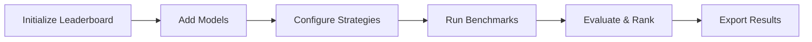

# Model Comparison with TabularLeaderboard

The `TabularLeaderboard` is a powerful benchmarking tool that enables systematic comparison of multiple models and tuning strategies on your dataset. This guide shows how to use it effectively.

---

## 1. Overview

`TabularLeaderboard` simplifies the process of comparing different TabTune models and strategies:

- ✅ Compare multiple models simultaneously
- ✅ Test different tuning strategies (inference, base-ft, peft)
- ✅ Rank results by any evaluation metric
- ✅ Export results for analysis
- ✅ Track experiment metadata
- ✅ Visualize performance comparisons

---

## 2. Core Concepts

### 2.1 Workflow



### 2.2 Key Components

- **Leaderboard**: Container for managing multiple model configurations
- **Model Entry**: Single model + strategy + hyperparameter combination
- **Benchmark**: Complete evaluation run across all added models
- **Results**: Ranked comparison with metrics and metadata

---

## 3. Basic Usage

### 3.1 Initialize Leaderboard

```python
from tabtune import TabularLeaderboard
from sklearn.model_selection import train_test_split

# Prepare data splits
X, y = load_your_data()
X_train, X_test, y_train, y_test = train_test_split(X, y, test_size=0.2, random_state=42)

# Initialize leaderboard
leaderboard = TabularLeaderboard(
    X_train=X_train,
    X_test=X_test,
    y_train=y_train,
    y_test=y_test,
    task_type='classification'
)
```

### 3.2 Add Models to Leaderboard

```python
# Add single model with default settings
leaderboard.add_model(
    model_name='TabPFN',
    tuning_strategy='inference'
)

# Add model with custom tuning parameters
leaderboard.add_model(
    model_name='TabICL',
    tuning_strategy='base-ft',
    model_params={'n_estimators': 16},
    tuning_params={'epochs': 5, 'learning_rate': 2e-5}
)

# Add same model with different strategy
leaderboard.add_model(
    model_name='TabICL',
    tuning_strategy='peft',
    model_params={'n_estimators': 16},
    tuning_params={
        'epochs': 5,
        'learning_rate': 2e-4,
        'peft_config': {'r': 8, 'lora_alpha': 16}
    }
)
```

### 3.3 Run Benchmarks

```python
# Run all added models
results = leaderboard.run()

# Run with custom settings
results = leaderboard.run(
    rank_by='roc_auc_score',  # Metric to rank by
    verbose=True,              # Print progress
    n_jobs=1                   # Parallel jobs (1 = sequential)
)
```

---

## 4. Complete Example

### 4.1 Full Comparison Workflow

```python
from tabtune import TabularLeaderboard
import pandas as pd
from sklearn.model_selection import train_test_split

# 1. Load data
df = pd.read_csv('dataset.csv')
X = df.drop('target', axis=1)
y = df['target']

# 2. Split data
X_train, X_test, y_train, y_test = train_test_split(X, y, test_size=0.2)

# 3. Initialize leaderboard
leaderboard = TabularLeaderboard(X_train, X_test, y_train, y_test)

# 4. Add models - Inference Baseline
leaderboard.add_model('TabPFN', 'inference', name='TabPFN-Inference')

# 5. Add models - PEFT Strategies
for model in ['TabICL', 'OrionMSP', 'OrionBix', 'Mitra']:
    leaderboard.add_model(
        model,
        'peft',
        name=f'{model}-PEFT',
        tuning_params={
            'epochs': 3,
            'peft_config': {'r': 8, 'lora_alpha': 16}
        }
    )

# 6. Add models - Base Fine-Tuning (for comparison)
leaderboard.add_model(
    'TabICL',
    'base-ft',
    name='TabICL-BaseFT',
    tuning_params={'epochs': 5, 'learning_rate': 2e-5}
)

# 7. Run benchmarks
results = leaderboard.run(rank_by='accuracy', verbose=True)
```

---

## 5. Class Reference

### 5.1 TabularLeaderboard Constructor

```python
TabularLeaderboard(
    X_train: pd.DataFrame,
    X_test: pd.DataFrame,
    y_train: pd.Series,
    y_test: pd.Series,
    task_type: str = 'classification',
    validation_split: float = 0.1,
    random_state: int = 42
)
```

**Parameters**:

| Parameter | Type | Default | Description |
|-----------|------|---------|-------------|
| `X_train` | DataFrame | Required | Training features |
| `X_test` | DataFrame | Required | Test features |
| `y_train` | Series | Required | Training labels |
| `y_test` | Series | Required | Test labels |
| `task_type` | str | 'classification' | 'classification' or 'regression' |
| `validation_split` | float | 0.1 | Fraction for validation |
| `random_state` | int | 42 | Random seed for reproducibility |

### 5.2 add_model() Method

```python
leaderboard.add_model(
    model_name: str,
    tuning_strategy: str,
    name: str = None,
    model_params: dict = None,
    tuning_params: dict = None,
    processor_params: dict = None
)
```

**Parameters**:

| Parameter | Type | Default | Description |
|-----------|------|---------|-------------|
| `model_name` | str | Required | Model to add (TabPFN, TabICL, etc.) |
| `tuning_strategy` | str | Required | 'inference', 'base-ft', or 'peft' |
| `name` | str | None | Custom name for leaderboard (auto-generated if None) |
| `model_params` | dict | None | Model-specific hyperparameters |
| `tuning_params` | dict | None | Training hyperparameters |
| `processor_params` | dict | None | Preprocessing parameters |

### 5.3 run() Method

```python
results = leaderboard.run(
    rank_by: str = 'accuracy',
    verbose: bool = True,
    timeout: float = None
)
```

**Parameters**:

| Parameter | Type | Default | Description |
|-----------|------|---------|-------------|
| `rank_by` | str | 'accuracy' | Metric to rank models |
| `verbose` | bool | True | Print progress |
| `timeout` | float | None | Timeout per model in seconds |

**Return**: `LeaderboardResults` object with all benchmarks


---

## 6. Advanced Usage

### 6.1 Custom Model Names

```python
# Add with meaningful names
leaderboard.add_model(
    'TabICL',
    'peft',
    name='TabICL-PEFT-r8',
    tuning_params={'peft_config': {'r': 8}}
)

leaderboard.add_model(
    'TabICL',
    'peft',
    name='TabICL-PEFT-r16',
    tuning_params={'peft_config': {'r': 16}}
)

results = leaderboard.run(rank_by='accuracy')
```

### 6.2 Hyperparameter Grid

Test multiple hyperparameter combinations:

```python
from itertools import product

# Define hyperparameter grid
learning_rates = [1e-5, 2e-5, 5e-5]
ranks = [4, 8, 16]

# Grid search
for lr, r in product(learning_rates, ranks):
    leaderboard.add_model(
        'TabICL',
        'peft',
        name=f'TabICL-lr{lr}-r{r}',
        tuning_params={
            'learning_rate': lr,
            'peft_config': {'r': r, 'lora_alpha': 2*r}
        }
    )

results = leaderboard.run(rank_by='f1_score', verbose=True)
print(leaderboard.get_ranking())
```

### 6.3 Strategy Comparison

Compare all three strategies for a model:

```python
model = 'TabDPT'

# Inference baseline
leaderboard.add_model(model, 'inference', name=f'{model}-Inference')

# Base fine-tuning
leaderboard.add_model(
    model, 'base-ft',
    name=f'{model}-BaseFT',
    tuning_params={'epochs': 5}
)

# PEFT fine-tuning
leaderboard.add_model(
    model, 'peft',
    name=f'{model}-PEFT',
    tuning_params={'epochs': 5, 'peft_config': {'r': 8}}
)

results = leaderboard.run()

# Extract strategy comparison
for name, score in results.items():
    strategy = name.split('-')[-1]
    print(f"{strategy}: {score['accuracy']:.4f}")
```

### 6.4 Cross-Validation

Test stability across multiple folds:

```python
from sklearn.model_selection import KFold

kf = KFold(n_splits=5)
fold_results = []

for fold_idx, (train_idx, test_idx) in enumerate(kf.split(X)):
    X_train_fold, X_test_fold = X.iloc[train_idx], X.iloc[test_idx]
    y_train_fold, y_test_fold = y.iloc[train_idx], y.iloc[test_idx]
    
    # Create leaderboard for this fold
    lb = TabularLeaderboard(X_train_fold, X_test_fold, y_train_fold, y_test_fold)
    
    # Add models
    lb.add_model('TabICL', 'peft')
    lb.add_model('OrionBix', 'base-ft')
    
    # Run and store
    results = lb.run()
    fold_results.append(results)

# Aggregate results
import pandas as pd
all_results = pd.concat(fold_results)
print(all_results.groupby('model').mean())
```

---

## 7. Evaluation Metrics

Supported metrics for ranking:

**Classification Metrics**:
- `accuracy`: Fraction of correct predictions
- `f1_score`: Harmonic mean of precision and recall (weighted)
- `roc_auc_score`: Area under ROC curve
- `precision_score`: True positives / (TP + FP)
- `recall_score`: True positives / (TP + FN)
- `balanced_accuracy`: Average per-class accuracy

**Regression Metrics**:
- `mse`: Mean squared error (lower is better)
- `rmse`: Root mean squared error
- `mae`: Mean absolute error
- `r2_score`: Coefficient of determination

```python
# Rank by different metrics
results_acc = leaderboard.run(rank_by='accuracy')
results_f1 = leaderboard.run(rank_by='f1_score')
results_auc = leaderboard.run(rank_by='roc_auc_score')
```

---


---


## 8. Best Practices

### ✅ Do's

- ✅ Use consistent data splits across all models
- ✅ Fix random seed for reproducibility
- ✅ Include inference baseline for comparison
- ✅ Test multiple strategies for each model
- ✅ Save results to disk
- ✅ Use reasonable timeout values
- ✅ Export results as CSV for further analysis

### ❌ Don'ts

- ❌ Don't change data between runs
- ❌ Don't use training data for validation
- ❌ Don't tune hyperparameters on test set
- ❌ Don't mix different task types in one leaderboard
- ❌ Don't run without timeout protection
- ❌ Don't forget to save best model config

---

## 9. Complete Workflow Example

```python
from tabtune import TabularLeaderboard
import pandas as pd
from sklearn.model_selection import train_test_split

# Step 1: Load and prepare data
print("Loading data...")
df = pd.read_csv('data.csv')
X = df.drop('target', axis=1)
y = df['target']
X_train, X_test, y_train, y_test = train_test_split(X, y, test_size=0.2, random_state=42)

# Step 2: Initialize leaderboard
print("Initializing leaderboard...")
lb = TabularLeaderboard(X_train, X_test, y_train, y_test)

# Step 3: Add baseline
print("Adding inference baseline...")
lb.add_model('TabPFN', 'inference')

# Step 4: Add PEFT models
print("Adding PEFT models...")
for model in ['TabICL', 'OrionMSP', 'OrionBix', 'TabDPT']:
    lb.add_model(
        model, 'peft',
        tuning_params={'epochs': 3, 'peft_config': {'r': 8}}
    )

# Step 5: Run benchmarks
print("Running benchmarks...")
results = lb.run(rank_by='accuracy', verbose=True, n_jobs=-1)


```

---

## 10. Next Steps

- [Model Selection](model-selection.md) - Guide for choosing models
- [Tuning Strategies](tuning-strategies.md) - Deep dive into strategies
- [Examples](../examples/benchmarking.md) - More examples

---

The `TabularLeaderboard` streamlines model selection by enabling systematic, reproducible benchmarking!