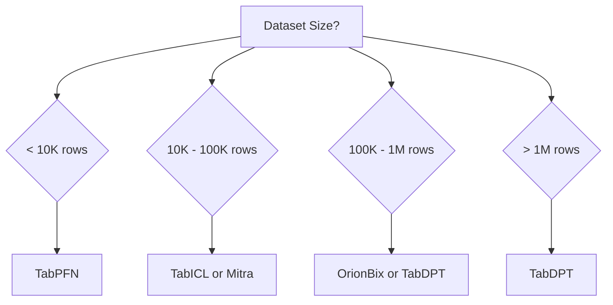

# Model Selection

Choosing the right model for your tabular task is crucial for achieving optimal performance. This guide helps you navigate TabTune's model ecosystem and select the best model for your specific use case.

---

## 1. Model Overview

| Model | Family | Best For | Dataset Size | PEFT Support | Training Speed |
|-------|--------|----------|--------------|--------------|----------------|
| **TabPFN** | PFN/ICL | Small datasets, quick experiments | <10K rows | ⚠️ Experimental | ⭐⭐⭐⭐⭐ |
| **TabICL** | Scalable ICL | General tabular, balanced performance | 10K-1M rows | ✅ Full | ⭐⭐⭐⭐ |
| **OrionMSP** | Scalable ICL | Balanced generalization | 50K-2M+ rows | ✅ Full | ⭐⭐⭐ |
| **OrionBix** | Scalable ICL | High-accuracy scenarios | 10K-1M rows | ✅ Full | ⭐⭐⭐ |
| **TabDPT** | Denoising | Large datasets, robust features | 100K-5M rows | ✅ Full | ⭐⭐⭐ |
| **Mitra** | 2D Attention | Complex patterns, mixed types | 10K-500K rows | ✅ Full | ⭐⭐ |
| **ContextTab** | Semantic ICL | Text-heavy features, semantics | 10K-500K rows | ⚠️ Experimental | ⭐⭐ |

---

## 2. Decision Framework

### 2.1 By Dataset Size



**Small (<10K rows)**
- **Recommended**: TabPFN, Mitra
- **Alternative**: TabICL with small `n_estimators`

**Medium (10K-100K rows)**
- **Recommended**: TabICL
- **Alternatives**: Mitra, OrionMSP, OrionBix

**Large (100K-1M rows)**
- **Recommended**: OrionMSP, OrionBix, TabDPT
- **Alternative**: TabICL with larger `n_estimators`

**Very Large (>1M rows)**
- **Recommended**: TabDPT
- **Alternative**: OrionBix with chunked training

---

### 2.2 By Feature Types

**Primarily Numerical**
- **Best**: TabDPT, TabICL
- **Reason**: Efficient scaling and normalization pipelines

**Primarily Categorical**
- **Best**: TabPFN (if small), ContextTab
- **Reason**: Specialized categorical encoding

**Mixed (Numerical + Categorical)**
- **Best**: TabICL, OrionMSP, OrionBix, Mitra
- **Reason**: Balanced handling of both types

**Text/Semantic Features**
- **Best**: ContextTab
- **Reason**: Built-in text embedding support

---

### 2.3 By Computational Budget

**Limited Resources (<8GB GPU)**
- **Recommended**: TabPFN (inference), TabICL (PEFT)
- **Strategy**: Use `peft` tuning strategy

**Moderate Resources (8-16GB GPU)**
- **Recommended**: TabICL, OrionMSP, OrionBix
- **Strategy**: `base-ft` or `peft`

**Ample Resources (>16GB GPU)**
- **Recommended**: TabDPT, Mitra, OrionBix
- **Strategy**: `base-ft` with mixed precision

---

### 2.4 By Use Case

**Quick Prototyping**
- **Model**: TabPFN, TabICL
- **Strategy**: `inference`
- **Reason**: Zero-shot predictions, instant results

**Production Deployment**
- **Model**: OrionMSP, OrionBix, TabDPT
- **Strategy**: `base-ft`
- **Reason**: Highest accuracy, stable performance

**Research/Experimentation**
- **Model**: Any with `peft`
- **Strategy**: `peft`
- **Reason**: Fast iteration, low cost

**High Accuracy Priority**
- **Model**: OrionMSP, OrionBix, TabDPT
- **Strategy**: `base-ft` with extensive tuning
- **Reason**: State-of-the-art performance

---

## 3. Detailed Model Profiles

### 3.1 TabPFN

**Architecture**: Prior-Fitted Network with approximate Bayesian inference

**Strengths**:
- ⭐ Extremely fast inference
- ⭐ No training required for small datasets
- ⭐ Robust to hyperparameter choices
- ⭐ Good uncertainty estimates

**Limitations**:
- ⚠️ Limited to ~10K training samples
- ⚠️ Maximum ~100 features
- ⚠️ PEFT support experimental
- ⚠️ Binary and multi-class classification only

**Ideal Use Cases**:
- Quick baseline comparisons
- Small-scale classification tasks
- Kaggle competitions with small data
- A/B testing with limited samples

**Example Configuration**:
```python
from tabtune import TabularPipeline

pipeline = TabularPipeline(
    model_name='TabPFN',
    tuning_strategy='inference',  # or 'base-ft' for adaptation
)
```

---

### 3.2 TabICL

**Architecture**: Two-stage in-context learning (column → row attention)

**Strengths**:
- ⭐ Balanced speed and accuracy
- ⭐ Scales to 1M+ rows
- ⭐ Full PEFT support
- ⭐ Ensemble-based robustness

**Limitations**:
- ⚠️ Requires episodic training for fine-tuning
- ⚠️ More memory than TabPFN
- ⚠️ Slower inference with high `n_estimators`

**Ideal Use Cases**:
- General-purpose tabular classification
- Medium to large datasets
- Tasks requiring model adaptation
- Ensemble predictions for robustness

**Example Configuration**:
```python
pipeline = TabularPipeline(
    model_name='TabICL',
    tuning_strategy='peft',
    model_params={
        'n_estimators': 32,
        'softmax_temperature': 0.9
    },
    tuning_params={
        'device': 'cuda',
        'epochs': 5,
        'support_size': 48,
        'query_size': 32,
        'n_episodes': 1000,
        'peft_config': {'r': 8, 'lora_alpha': 16}
    }
)
```

---

### 3.3 OrionMSP

**Architecture**: Multi-scale sparse attention for scalable in-context learning

**Strengths**:
- ⭐ Strong generalization with multi-scale priors
- ⭐ Balanced performance across dataset sizes
- ⭐ Full PEFT support
- ⭐ Efficient column-then-row attention

**Limitations**:
- ⚠️ Requires larger datasets for best performance (≥50K rows)
- ⚠️ Moderate memory requirements
- ⚠️ Slower than TabICL for small datasets

**Ideal Use Cases**:
- Medium to large datasets (50K-2M+ rows)
- Tasks requiring strong generalization
- Balanced speed/accuracy requirements
- Production systems with moderate compute

**Example Configuration**:
```python
pipeline = TabularPipeline(
    model_name='OrionMSP',
    tuning_strategy='base-ft',
    model_params={
        'n_estimators': 16,
        'softmax_temperature': 0.9
    },
    tuning_params={
        'device': 'cuda',
        'epochs': 5,
        'support_size': 1024,
        'query_size': 256,
        'learning_rate': 2e-5
    }
)
```

---

### 3.4 OrionBix

**Architecture**: Custom variant of TabICL with biaxial attention mechanisms

**Strengths**:
<!-- - ⭐ Higher accuracy than TabICL
- ⭐ Better feature interaction modeling
- ⭐ Full PEFT support
- ⭐ Handles complex patterns -->

**Limitations**:
<!-- - ⚠️ Slower training than TabICL
- ⚠️ Higher memory requirements
- ⚠️ More hyperparameters to tune -->

**Ideal Use Cases**:
- High-stakes applications (finance, healthcare)
- Complex feature interactions
- When accuracy > speed
- Production models with tuning budget

**Example Configuration**:
```python
pipeline = TabularPipeline(
    model_name='OrionBix',
    tuning_strategy='base-ft',
    model_params={
        'n_estimators': 32
    },
    tuning_params={
        'device': 'cuda',
        'epochs': 5,
        'support_size': 48,
        'query_size': 32,
        'learning_rate': 2e-5
    }
)
```

---

### 3.5 TabDPT

**Architecture**: Denoising pre-trained transformer with k-NN context selection

**Strengths**:
- ⭐ Scales to very large datasets (5M+ rows)
- ⭐ Robust to noisy features
- ⭐ Strong generalization
- ⭐ Full PEFT support

**Limitations**:
- ⚠️ Requires large training sets for best performance
- ⚠️ Longer training time
- ⚠️ Memory-intensive for large context sizes

**Ideal Use Cases**:
- Large-scale production systems
- Datasets with noisy/missing features
- Long-term deployed models
- High-accuracy requirements

**Example Configuration**:
```python
pipeline = TabularPipeline(
    model_name='TabDPT',
    tuning_strategy='base-ft',
    model_params={
        'n_ensembles': 8,
        'temperature': 0.3,
        'context_size': 2048
    },
    tuning_params={
        'device': 'cuda',
        'epochs': 3,
        'support_size': 1024,
        'query_size': 256,
        'steps_per_epoch': 15
    }
)
```

---

### 3.6 Mitra

**Architecture**: 2D cross-attention (Tab2D) with synthetic priors

**Strengths**:
- ⭐ Excellent for mixed-type features
- ⭐ Captures row and column dependencies
- ⭐ Full PEFT support
- ⭐ Strong on structured data

**Limitations**:
- ⚠️ Slowest training among ICL models
- ⚠️ High memory usage
- ⚠️ Requires careful hyperparameter tuning
- ⚠️ Small batch sizes needed

**Ideal Use Cases**:
- Structured databases (SQL-like tables)
- Scientific datasets with meaningful columns
- Time-series tabular data
- Complex multi-variate relationships

**Example Configuration**:
```python
pipeline = TabularPipeline(
    model_name='Mitra',
    tuning_strategy='peft',
    tuning_params={
        'device': 'cuda',
        'epochs': 3,
        'support_size': 128,
        'query_size': 128,
        'steps_per_epoch': 50,
        'batch_size': 4,
        'peft_config': {'r': 8, 'lora_alpha': 16}
    }
)
```

---

### 3.7 ContextTab

**Architecture**: Semantics-aware ICL with modality-specific embeddings

**Strengths**:
- ⭐ Best for text-heavy features
- ⭐ Semantic understanding of column names
- ⭐ Handles heterogeneous data types
- ⭐ Pre-trained on diverse tabular corpora

**Limitations**:
- ⚠️ Requires HuggingFace Hub access
- ⚠️ PEFT support experimental
- ⚠️ Slower inference due to embedding computation
- ⚠️ Limited to specific feature types

**Ideal Use Cases**:
- Datasets with free-text columns
- Survey data with semantic features
- Product catalogs, reviews
- Mixed structured/unstructured data

**Example Configuration**:
```python
# Requires HF_TOKEN environment variable
pipeline = TabularPipeline(
    model_name='ContextTab',
    tuning_strategy='base-ft',  # Use base-ft, not peft
    tuning_params={
        'device': 'cuda',
        'epochs': 10,
        'learning_rate': 1e-4,
        'batch_size': 8
    }
)
```

---


## 4. Model Selection Checklist

Use this checklist to guide your decision:

**Dataset Characteristics**
- [ ] How many rows? (<10K, 10K-100K, 100K-1M, >1M)
- [ ] How many features? (<50, 50-100, >100)
- [ ] Feature types? (Numerical, Categorical, Mixed, Text)
- [ ] Class balance? (Balanced, Imbalanced)
- [ ] Missing values? (None, Few, Many)

**Requirements**
- [ ] Priority: Speed vs. Accuracy?
- [ ] GPU available? (None, <8GB, 8-16GB, >16GB)
- [ ] Training time budget? (Minutes, Hours, Days)
- [ ] Deployment constraints? (Model size, inference latency)

**Recommendations Based on Checklist**

```
If dataset < 10K rows → TabPFN
If dataset 10K-100K rows AND balanced types → TabICL
If dataset 50K-2M rows AND balanced → OrionMSP
If dataset 10K-100K rows AND high accuracy needed → OrionBix
If dataset > 100K rows → TabDPT
If text features present → ContextTab
If complex patterns + mixed types → Mitra
If GPU < 8GB → TabPFN or TabICL with PEFT
If speed critical → TabPFN (inference)
If accuracy critical → OrionBix or TabDPT (base-ft)
```

---

## 5. Hybrid Approaches

### Ensemble Multiple Models

```python
from tabtune import TabularLeaderboard

leaderboard = TabularLeaderboard(X_train, X_test, y_train, y_test)

# Add multiple models
leaderboard.add_model('TabPFN', 'inference')
leaderboard.add_model('TabICL', 'peft', tuning_params={'epochs': 5})
leaderboard.add_model('OrionMSP', 'base-ft', tuning_params={'epochs': 5})
leaderboard.add_model('OrionBix', 'base-ft', tuning_params={'epochs': 5})

# Run and compare
results = leaderboard.run(rank_by='roc_auc_score')

# Ensemble predictions (average probabilities)
from sklearn.ensemble import VotingClassifier
# Use predictions from top 3 models for ensemble
```

---

## 6. Advanced Selection Criteria

### 6.1 Explainability Requirements

- **High Explainability**: TabPFN (inherent uncertainty), TabICL (attention weights)
- **Moderate Explainability**: TabDPT (feature importance)
- **Low Explainability**: Mitra, ContextTab (complex architectures)

### 6.2 Regulatory Compliance

- **Medical/Financial**: OrionMSP, OrionBix, TabDPT (reproducible, auditable)
- **General**: Any model with saved checkpoints and logged hyperparameters

### 6.3 Transfer Learning

- **Best for Transfer**: TabDPT (large pre-training corpus)
- **Moderate Transfer**: TabICL, ContextTab
- **Limited Transfer**: TabPFN (task-specific priors)

---

## 7. Next Steps

- [Pipeline Overview](pipeline-overview.md) - Learn the TabularPipeline API
- [Model Documentation](../models/overview.md) - Detailed model specifications
- [TabularLeaderboard](leaderboard.md) - Compare models systematically

---

Select your model wisely, and iterate based on your specific requirements and constraints!