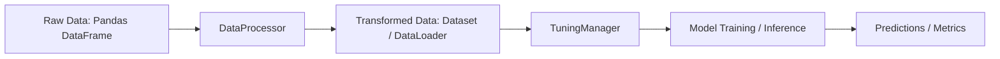

# TabularPipeline Overview

This document provides an in-depth look at the `TabularPipeline` class—the central entry point for using TabTune’s end-to-end workflows.

---

## 1. Architecture Diagram



- **DataProcessor**: Prepares input features and labels for models.
- **TuningManager**: Executes the specified strategy (`inference`, `base-ft`, `peft`).
- **Model**: Underlying tabular foundation model (e.g., TabPFN, TabICL).
- **Output**: Predictions and evaluation metrics.

---

## 2. Class Signature

```python
class TabularPipeline:
    def __init__(
        self,
        model_name: str,
        task_type: str = 'classification',
        tuning_strategy: str = 'inference',
        tuning_params: dict | None = None,
        processor_params: dict | None = None,
        model_params: dict | None = None,
        model_checkpoint_path: str | None = None
    )
```

- **model_name**: Name of the model to instantiate (e.g., `TabPFN`, `TabICL`).
- **task_type**: Either `classification` or `regression`.
- **tuning_strategy**: One of `inference`, `base-ft`, or `peft`.
- **tuning_params**: Hyperparameters for training/inference (device, epochs, learning_rate, etc.).
- **processor_params**: Options for data preprocessing (imputation, scaling, encoding).
- **model_params**: Direct parameters for the model constructor.
- **model_checkpoint_path**: Path to load pre-trained weights.

---

## 3. Core Methods

### 3.1 .fit(X, y)
```python
pipeline.fit(X_train: DataFrame, y_train: Series) -> None
```
- **Description**: Runs preprocessing and training.
- **Workflow**:
  1. Fit `DataProcessor` on `X_train, y_train`.
  2. Create PyTorch `Dataset` and `DataLoader`.
  3. Execute `TuningManager` training loop if strategy != `inference`.

### 3.2 .predict(X)
```python
predictions = pipeline.predict(X_test: DataFrame) -> np.ndarray
```
- **Description**: Preprocesses `X_test` and returns model predictions.
- **Notes**: In `inference` mode, loads pre-trained model and runs forward passes.

### 3.3 .evaluate(X, y)
```python
metrics = pipeline.evaluate(X_test: DataFrame, y_test: Series) -> dict
```
- **Description**: Calls `.predict()`, then computes specified metrics.
- **Default Metrics**: Accuracy, Weighted F1, ROC AUC.

### 3.4 .save(path)
```python
pipeline.save('pipeline.joblib')
```
- **Description**: Serializes the pipeline including processor, model state, and config.

### 3.5 .load(path)
```python
loaded = TabularPipeline.load('pipeline.joblib')
```
- **Description**: Loads a saved pipeline for inference or continued training.

---

## 4. Configuration Best Practices

- **Use config files**: YAML/JSON to record experiments reproducibly.
- **Version control**: Commit `tuning_params` and `processor_params` along with code.
- **Checkpointing**: Save intermediate checkpoints via `model_checkpoint_path` for long runs.

---

## 5. Example Usage

```python
from tabtune import TabularPipeline

# Setup pipeline
pipeline = TabularPipeline(
    model_name='TabICL',
    tuning_strategy='peft',
    tuning_params={'device':'cuda','epochs':5,'learning_rate':2e-4},
    processor_params={'imputation_strategy':'median'},
    model_params={'n_estimators':16}
)

# Train
pipeline.fit(X_train, y_train)

# Predict & evaluate
metrics = pipeline.evaluate(X_test, y_test)
print(metrics)
```

---

## 6. Error Handling

- **Invalid model_name**: Raises `ValueError` with supported model list.
- **Unsupported strategy**: Raises `ValueError` advising available strategies.
- **Missing data**: Raises `DataValidationError` if nulls present after imputation.

---

## 7. Extending TabularPipeline

- **Custom pipeline**: Subclass `TabularPipeline` and override `_setup_processors` or `_setup_manager`.
- **Custom metrics**: Pass `metrics=[your_metric_fn]` to `.evaluate()`.
- **Callbacks**: Integrate PyTorch Lightning callbacks via `tuning_params`.

This overview should help you understand and utilize `TabularPipeline` for all your tabular modeling needs.